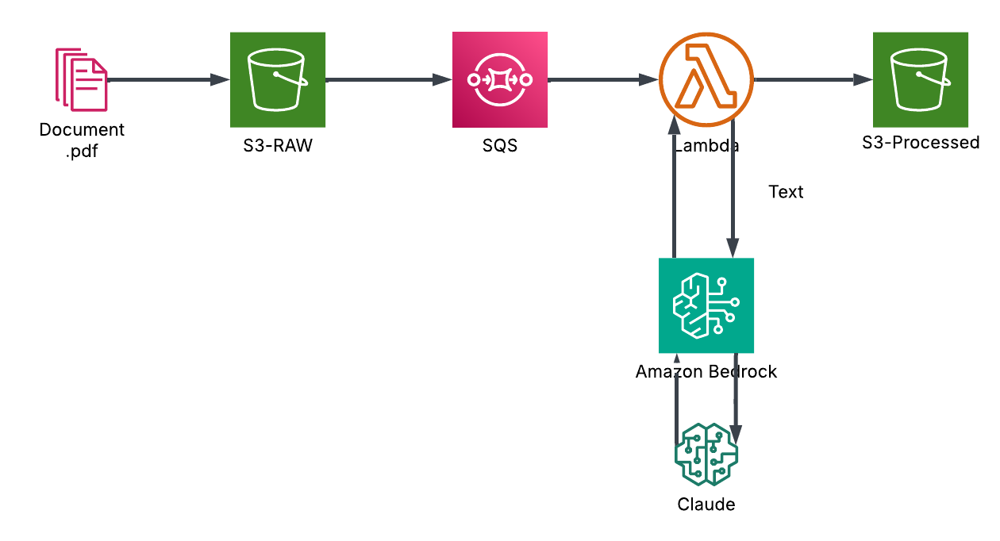

# Document Processor

A serverless document processing pipeline using CLaude through AWS Bedrock.

## Architecture

- S3 buckets for raw and processed documents
- Lambda functions for processing
- SQS for message handling
- AWS Bedrock for the call to Claude LLM (Need to enable model access)

## Setup

1. Configure AWS credentials for the account that will host the infrastructure
2. Setting up a remote state (Optional): Set up the Terraform backend bucket and dynamo table and edit the terraform/provider.tf file with the correct values
3. Edit the terraform/terraform.tfvars file with the correct values for the region and project name.   
**NOTE**: It is important to edit the `project_name` in the `terraform.tfvars` file since the S3 buckets carry that name and must be globally unique.
4. `cd terraform`
5. Run `terraform init` to initialize the Terraform configuration
6. Run `terraform plan` to see the changes that will be applied
7. Run `terraform apply` to create the infrastructure
8. Test the system: 
   - Upload an invoice document (extension .png) to the `{project-name}-raw-documents` S3 bucket. A test invoice can be found in the `docs` folder.
   - Check the `{project-name}-processed-documents` S3 bucket for the results

9. Run `terraform destroy` to destroy the infrastructure when you're done

